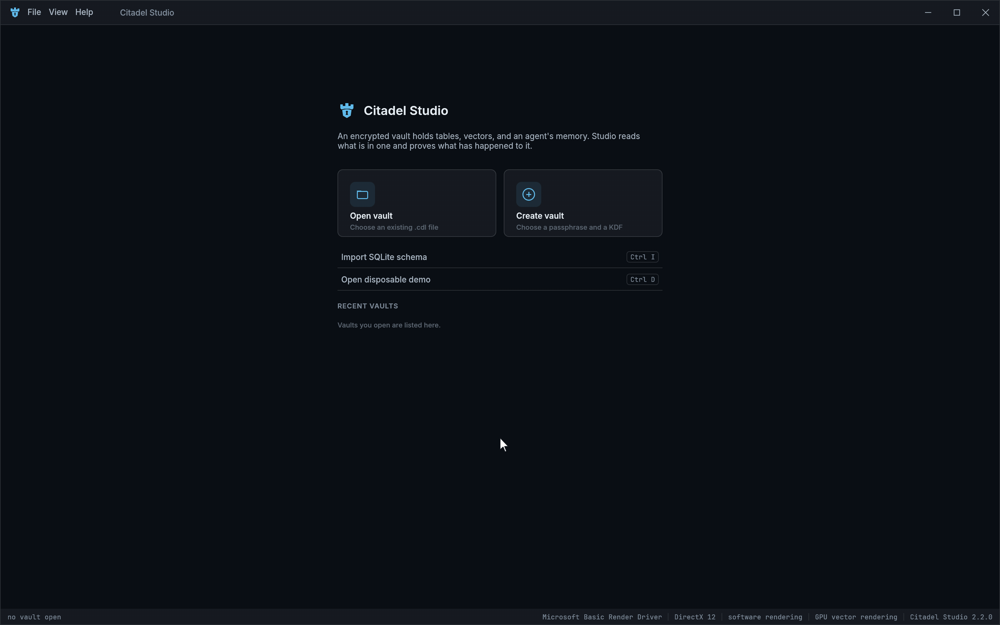

# citadeldb-studio

Native desktop client for [CitadelDB](https://github.com/yp3y5akh0v/citadel). Browse an
encrypted vault, run SQL, inspect stored vectors, and verify or erase memory atoms.
Studio uses the database, SQL, and memory engines locally; no server or embedding model
is required.



Stored-data views show verification status and scope, including how many visible items
were checked. SQL results and vector plots carry no per-atom attestation.

## Install and run

Studio is packaged as an AppImage for Linux x86_64, a DMG for macOS Intel or Apple Silicon,
and an MSI for Windows x86_64. [Download Citadel Studio](https://citadeldb.dev/download/#studio)
or see the [installation notes](../../packaging/README.md). Studio is not published to crates.io.

To build from this repository, use Rust 1.95 or later:

```sh
cargo run --locked -p citadeldb-studio
```

Linux builds also need the desktop libraries listed in
[the build dependency setup](../../.github/actions/studio-deps/action.yml). Studio is
excluded from the default workspace build and must be selected explicitly.

On Home, create a vault, open an existing vault, or select `Open disposable demo`.
The demo needs no file or passphrase and discards its temporary encrypted vault when
closed. Changes to other vaults persist normally. Close a vault in other Citadel
processes before opening it in Studio; the database uses an exclusive file lock.

## Memory and security

Browse memory regions and atoms, verify visible atoms from storage, and forget selected
atoms. Verification is limited to the checked atoms, not the whole region. Encrypted
regions support per-atom attestation and cryptographic erasure; plaintext regions do not.
Studio preserves immutable atoms and displays erasure receipts for the current session.

The security view shows cipher and key-derivation settings, audit-chain status when
available, full-vault integrity checks, and passphrase changes.

## SQL

The SQL editor supports syntax highlighting, formatting, multi-statement scripts, and
query plans. `Explain` plans without execution; `Analyze (runs)` executes the statement
and reports actual time plus scanned and emitted rows. The result grid retains up to
2,000 rows per statement. A script stops at its first error; earlier committed changes
remain.

SQLite schema import opens the source read-only and translates column types and primary
keys into table definitions. Every source table must have a primary key. It does not
copy rows or translate defaults, other constraints, indexes, triggers, or views.

## Vectors

Pan, zoom and pick a bounded sample of a vector column. The plot maps the first two stored
dimensions and normalizes each independently over that sample; it is not dimensionality
reduction, and screen distance is not index distance.

## Tests

```sh
cargo test --locked -p citadeldb-studio
```

The headless application tests use `egui_kittest` with a wgpu device, write screen renders
to `target/studio-shots/`, and check that they are non-blank. A compatible hardware or
software GPU driver is required.

`docs/` contains the demo recording and memory, SQL, and vector screenshots. Regenerate
the recording with [studio-demo.sh](../../scripts/studio-demo.sh).

## License

Apache-2.0. Bundled fonts remain under their upstream licences; see
[Third-party notices](licenses/THIRD_PARTY_NOTICES.md).
